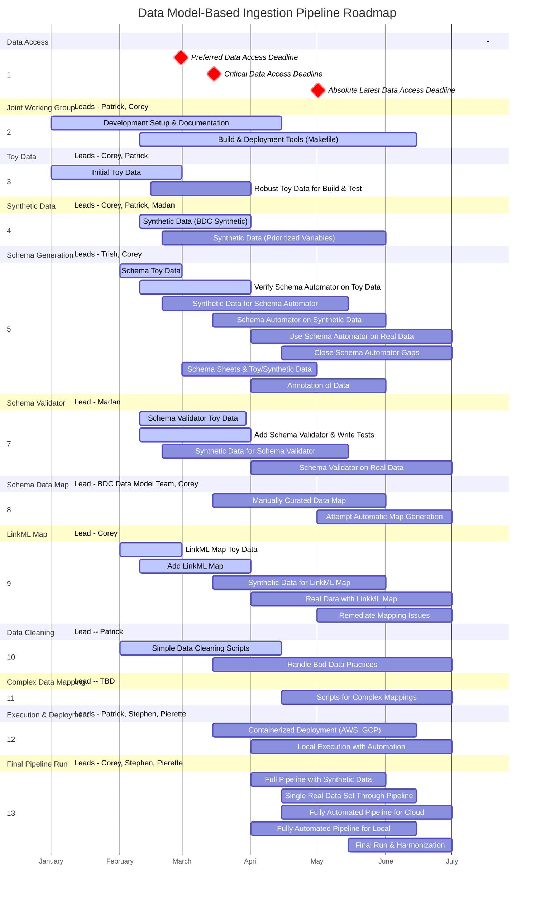

# Development Overview
This document contains the project development outline and assignments as well as associated timeline and project roadmap. This is intended to be used as a tool for organizing our project development and understanding our needs to meet out timeline.

# Project Roadmap
This Gantt chart represents a starting point for understanding the timeline for our development and serves a roadmap for our development stages. This a high-level chart showing the different parts of the project and how development time can ovelap. Currently, this is non-finalized and is intended only as a starting point for discussing the relative timelines of tasks.

# Project Outline
This outline captures the main features shown in the project roadmap above. This outline can be more detailed and contains some project steps that are less useful in the top-level roadmap. We should plan to refine the use of these tools over time to capture the parts of the project that need to be represented at a top-level plan and a more detailed overview that collects all of the parts we are working on.

1. Joint Working Repository - Lead -- Patrick Golden
    1. Overall Project Documentation - Initial - Completed, Ongoing
    1. Automatic Project Documentation Deployment - Initial - In Progress
    1. Project Testing Suite - Initial - Completed, Needs Sub-tasks
    1. Automated Pre-Commit Project Testing - Completed
    1. Automated Build and Deployment Toolset - Makefile - Initial - In Progress
1. Ingest-Wide Toy Data Set - Lead -- Corey Cox & Patrick Golden
    1. Single Toy Data Set for Testing and Build Environment Validation Across Full Pipeline - Initial - In Progress
    1. Integration of Toy Data Set with Automated Build/Test Harness - Not Started
1. Ingest-Wide Synthetic Data Set - Assigned -- Corey Cox, Patrick Golden, Madan 
    1. Initial Synthetic Data Set Based on Data Available (BDC Synthetic) - In Progress
    1. Initial Synthetic Data Set Generated from BDC Model identified variables - Not Started
1. Schema Automator - Lead -- Trish Whetzel, helping -- Corey Cox
    1. Add Schema-Automator to Project and verify it works - In Progress
        1. Had to Downgrade Python Version from 3.13 to 3.12 for now
        1. Used BDC Synthetic Data and produced Schema, no true testing or validation
        1. Add Schema-Automator usage and installation process to documentation
    1. Create Toy Data Set to verify functionality and start testing harness
    1. Verify Schema-Automator works on Toy Data Set and Write Tests
    1. Create Synthetic Data Set for advanced Schema-Automator functionality
    1. Verify Schema-Automator works on Synthetic Data Set and Write Tests
    1. Use Schema-Automator on a real data set and evaluate gaps
    1. Close Schema Automator Gaps
        1. Add richer data to synthetic or toy data set to represent gaps
        1. Development on Schema Automator to add functionality
        1. Development on Upstream Complex Mapper for hard to add functionality
1. Schema Sheets for Data Dictionary - Lead -- Trish Whetzel
    1. Add Schema Sheets as additional tool to create data models
1. Annotation of the Data - Lead -- Trish Whetzel
1. Schema Validator - Lead -- Madan 
    1. Add Schema Validator to project and verify it works
    1. Create Toy Data Set to verify functionality and start testing harness
        1. Toy Data Set resembling output of Schema Automator
        1. Toy Data Set of data input to Schema Automator to validate to Schema
        1. Valid and invalid data sets for testing
    1. Verify Schema Validator works for Toy Data Set and Write Tests
    1. Create Synthetic Data Set for Schema Validatory and Write Tests
    1. Use Schema Validator on real data with Schema Automator generated schema
1. Schema Data Map - Yaml file that describes the map from one data model to another
    1. Manually Curated data map from BDC Data Model Team
    1. Attempt Automatic generation of map from LLM working group
1. LinkML Mapper - Doing the Transformation  - Lead -- Corey Cox
    1. Add LinkML Mapper to Project and verify it works
    1. Create Toy Data for LinkML Mapper functionality
        1. Toy Data Set used for Schema Automator Schema generation
        1. Schema Automator derived implicit data model from toy data set
        1. Toy Subset of the BDC Model appropriate for Toy Data set
        1. Toy Schema Data Map appropriate for all of the above Toy Data set items
    1. Verify LinkML Mapper works on toy data set
    1. Create Synthetic Data set for LinkML Mappers
        1. Synthetic Data set covering reasonable subset of real data
        1. Schema Automator derived data model for above synthetic data
        1. Appropriate Subset (or full set) of BDC Data Model
        1. Data map appropriate to the above synthetic data items
    1. Use LinkML Mapper on real data set using upstream ingest pipeline tool artifacts
    1. Remediate mappings that can't be performed by LinkML Mapper
        1. Identify variables that LinkML Mapper is unable to perform harmonization and mapping
        1. Create Issues in LinkML Mapper and assess feasibility of adding functionality to LinkML Mapper
        1. Add functionality to LinkML Mapper or add scripts to Complex Data Mapper on a per-variable manner
    1. Perform full ingest data transform with LinkML Mapper on real data
1. Simple Data Cleaner - Lead -- Patrick Golden
    1. Simple scripts necessary for Data cleaning outside of ingest pipeline
        1. Poorly formatted Enums (Male, male, M, 1 - all meaning male)
        1. Bad missing data representation (i.e. 9 for no data)
        1. Empty columns
        1. Other bad data practices we can’t expect our ingest to handle
1. Complex Data Mapper - Lead -- TBD
        1. One-off scripts on per dataset basis to map data that is too complex for the tools as the exist
        1. Create these as-needed for each variable that cannot be cleanly mapped with LinkML Mapper
1. Execution and Deployment pipeline - Lead -- BDC -- Patrick and Stephen, INCLUDE -- Pierette Lo
    1. Wrapping tools and steps into containers for deployment to cloud environments (BDC Catalyst through AWS, Google Cloud)
    1. Local system execution of pipeline in fully automated way if possible or with checkpoints and human-in-the-loop.
1. Running all data through pipeline to produce a harmonized whole - Lead -- BDC -- Corey Cox with Stephen Hwang, INCLUDE -- Pierette Lo
    1. With the final robust synthetic data set, run the full pipeline with both Cloud and Local architectures
    1. Run a single data set all the way through the pipeline either on Cloud or Local architecture
    1. Create Fully automated pipelines for real-world data set
        1. With initial working real-world data set create a full automated pipeline for Cloud Architecture
        1. Create fully automated pipeline for Local architecture
        1. Test over all appropriate systems
    1. Run the full pipeline on all of the target data sets with the appropriate architecture
        1. Identify failures and gaps for each of the data sets
        1. Fill identified gaps with issues and development in the approprite tool or Complex Data Mapper
        1. Final run for each data set to the harmonized model
