# Development Overview
This document contains the project development outline and assignments as well as associated timeline and project roadmap. This is intended to be used as a tool for organizing our project development and understanding our needs to meet out timeline.

# Project Roadmap
This Gantt chart represents a starting point for understanding the timeline for our development and serves a roadmap for our development stages. This a high-level chart showing the different parts of the project and how development time can ovelap. Currently, this is non-finalized and is intended only as a starting point for discussing the relative timelines of tasks.

**Note:** Date ranges represent planned timeline slots for visual layout, not actual work dates. Issues marked `:done` are confirmed closed in GitHub regardless of their displayed date range.

```mermaid
---
config:
  theme: dark
  themeVariables:
    taskBkgColor: '#8a8a8a'
    taskBorderColor: '#9a9a9a'
    activeTaskBkgColor: '#8b5cf6'
    activeTaskBorderColor: '#7c3aed'
    doneTaskBkgColor: '#238636'
    doneTaskBorderColor: '#2ea043'
    critBkgColor: '#0891b2'
    critBorderColor: '#06b6d4'
  gantt:
    displayMode: compact
    useWidth: 1200
---
gantt
    title Data Model-Based Ingestion Pipeline Roadmap
    dateFormat  YYYY-MM-DD

    section Release Control
    Q1 Start (Sept)     :milestone, q1, 2025-09-01, 0d
    Q2 Start (Dec)      :milestone, q2, 2025-12-01, 0d
    Q3 Start (Mar)      :milestone, q3, 2026-03-01, 0d
    Q4 Start (Jun)      :milestone, q4, 2026-06-01, 0d
    Q4 End (Aug)        :milestone, q4end, 2026-08-30, 0d
    Tracking Issue #186                     :crit, t186, 2025-10-10, 6w

    section 1 
    Reporting for JIRA (#182)                           :done, i182, 2025-08-01, 2025-10-01
    Create a new development Roadmap (#172)             :done, i172, 2025-08-20, 2025-11-15
    Move to uv as Python manager (#178)                 :done, i178, 2025-09-10, 2025-12-01
    Re-align Tracking Tickets and Tasks (#173)          :done, i173, 2025-09-25, 2025-12-20
    Update Dependencies and Release Strategy (#180)     :active, i180, 2025-12-20, 2026-03-30
    First dm-bip release (#193)                         :done, i193, 2025-10-01, 2025-12-19
    Automate Release creation process (#194)            :active, i194, 2025-12-01, 2026-03-15
    Improve Documentation (#50)                         :done, i50, 2025-11-15, 2026-01-31
    Add Markdown plugin for Sphinx (#41)                :i41, 2026-02-10, 2026-06-30
    Move Harmonica to external tool (#215)              :i215, 2026-02-15, 2026-06-12
    Implement Code Coverage Monitoring (#217)           :done, i217, 2026-02-05, 2026-05-15
    Improve Test Coverage (#218)                        :i218, 2026-03-15, 2026-06-10
    Fix linting errors in notebooks (#219)              :i219, 2026-04-01, 2026-06-15
    Silent Exception in updated_flatten_to_tsv (#226)   :done, i226, 2026-03-01, 2026-06-15
    Mixed CLI frameworks (#227)                         :done, i227, 2025-12-20, 2026-03-01

    section Pilot Data Delivery 
    Tracking Issue #185                     :crit, t185,2025-10-10, 6w

    section 2 
    Independent Re-ingestion of Dataset (#171)          :done, i171, 2025-09-25, 2025-12-19
    Ensure all Cohort groups are ingested (#221)        :active, i221, 2025-12-31, 2026-04-11
    Test new longitudinal transformation specs (#252)  :i252, 2026-04-12, 2026-08-01

    section Quality Control 
    Tracking Issue #187                     :crit, t187,2025-10-10, 6w

    section 3 
    Fix Measurement Observation Sets (#174)             :active, i174, 2025-12-10, 2026-03-15
    Create QC metrics (#196)                            :i196, 2026-02-01, 2026-05-15
    Create QC Documentation (#195)                      :i195, 2026-03-15, 2026-06-15

    section Pipeline Improvement
    Tracking Issue #188                     :crit, t188, 2025-10-10, 6w

    section 4 
    Full Ingestions Pipeline v2.0 (#168)                :done, i168, 2025-08-15, 2025-11-01
    Create a Dockerfile for containerization (#176)     :done, i176, 2025-09-05, 2025-12-15
    Add Docker to Dependencies (#179)                   :done, i179, 2025-10-01, 2025-12-30
    Add data mapping to automation (#167)               :done, i167, 2025-11-01, 2026-02-01
    Create tests for mapping script (#210)              :done, i210, 2025-10-01, 2025-12-20
    Add Containerization to Makefile (#177)             :active, i177, 2025-12-01, 2026-03-15
    Enable offset calculations in LinkML-Map (#169)     :active, i169, 2025-09-20, 2026-01-01
    Enum derivations (#211)                             :active, i211, 2026-01-01, 2026-03-15
    Add tooling for SchemaAutomator/Schemasheets (#80)  :i80, 2026-03-15, 2026-07-10
    Generalize map_data.py with INCLUDE mapping (#166)  :i166, 2026-02-01, 2026-07-25
    Add Containerization with Docker (#90)              :done, i90, 2025-12-20, 2026-03-15
    Implement data mapping from multiple classes (#222) :done, i222, 2026-02-01, 2026-05-27
    Tweak prefix and postfix in the Makefile (#230)     :done, i230, 2026-01-01, 2026-04-10
    Add CONFIG include support (#237)                   :done, i237, 2025-11-01, 2026-02-02
    LinkML-Map GUID generation (#235)                   :i235, 2026-02-03, 2026-05-01
    Refactor pipeline Makefile sentinels (#247)         :done, i247, 2025-12-15, 2026-04-03
    Add consent group filtering (#260)                  :done, i260, 2026-01-01, 2026-03-17
    Support parallel consent group processing (#251)    :i251, 2026-03-15, 2026-06-27

    section Audit Logs
    Tracking Issue #189                     :crit, t189, 2025-10-10, 6w

    section 5 
    Define Audit Log Requirements (#213)               :i213, 2026-04-30, 2026-08-10
    Replace print() with logging module (#223)         :done, i223, 2026-03-10, 2026-06-30
    Add log file for mapping step (#243)               :done, i243, 2025-11-15, 2026-02-02
    Schema-automator validation type issues (#232)     :active, i232, 2026-01-01, 2026-04-30
    Schema-automator optional null handling (#233)     :active, i233, 2026-01-01, 2026-04-10

    section DMC Integration
    Tracking Issue #191                     :crit, t191, 2025-10-10, 6w

    section 6 
    Incorporate Stata YAML authoring tool (#175)        :active, i175, 2025-11-01, 2026-03-01
    Improve Data Cleanup and add to Makefile (#170)     :done, i170, 2025-12-10, 2026-03-20
    Add variable digest files to pipeline (#204)        :active, i204, 2025-12-01, 2026-03-01
    make a data dictionary template (#103)              :i103, 2026-03-01, 2026-06-01
    Create GitHub workflow to container registry (#201) :i201, 2026-03-01, 2026-06-15
    Update Docker with uv (#208)                        :done, i208, 2025-10-01, 2025-12-10

    section BDC User On-Demand
    Tracking Issue #192                     :crit, t192, 2025-10-10, 6w

    section 7 
    Update README.md to current usage (#144)            :done, i144, 2025-09-01, 2025-12-15
    Post Pilot Toy Dataset Improvement (#117)           :active, i117, 2025-12-15, 2026-04-01
    Packages without wheels for Python 3.13 (#151)      :i151, 2026-04-01, 2026-07-15
    Implement or remove CLI (#216)                     :done, i216, 2025-11-01, 2026-01-19
    Remove Hardcoded entity list (#220)                :done, i220, 2026-01-19, 2026-04-10

    section AI Curation
    Tracking Issue #197                     :crit, t197, 2025-10-10, 6w

    section 8 
    Independent run of AI curation API (#198)           :done, i198, 2025-10-20, 2026-01-15
    Create script to run AI API (#199)                  :i199, 2026-01-15, 2026-04-15

    click t186 href "https://github.com/linkml/dm-bip/issues/186"
    click t185 href "https://github.com/linkml/dm-bip/issues/185"
    click t187 href "https://github.com/linkml/dm-bip/issues/187"
    click t188 href "https://github.com/linkml/dm-bip/issues/188"
    click t189 href "https://github.com/linkml/dm-bip/issues/189"
    click t191 href "https://github.com/linkml/dm-bip/issues/191"
    click t192 href "https://github.com/linkml/dm-bip/issues/192"
    click t197 href "https://github.com/linkml/dm-bip/issues/197"
    click i41 href "https://github.com/linkml/dm-bip/issues/41"
    click i50 href "https://github.com/linkml/dm-bip/issues/50"
    click i80 href "https://github.com/linkml/dm-bip/issues/80"
    click i90 href "https://github.com/linkml/dm-bip/issues/90"
    click i103 href "https://github.com/linkml/dm-bip/issues/103"
    click i117 href "https://github.com/linkml/dm-bip/issues/117"
    click i144 href "https://github.com/linkml/dm-bip/issues/144"
    click i151 href "https://github.com/linkml/dm-bip/issues/151"
    click i166 href "https://github.com/linkml/dm-bip/issues/166"
    click i167 href "https://github.com/linkml/dm-bip/issues/167"
    click i168 href "https://github.com/linkml/dm-bip/issues/168"
    click i169 href "https://github.com/linkml/dm-bip/issues/169"
    click i170 href "https://github.com/linkml/dm-bip/issues/170"
    click i171 href "https://github.com/linkml/dm-bip/issues/171"
    click i172 href "https://github.com/linkml/dm-bip/issues/172"
    click i173 href "https://github.com/linkml/dm-bip/issues/173"
    click i174 href "https://github.com/linkml/dm-bip/issues/174"
    click i175 href "https://github.com/linkml/dm-bip/issues/175"
    click i176 href "https://github.com/linkml/dm-bip/issues/176"
    click i177 href "https://github.com/linkml/dm-bip/issues/177"
    click i178 href "https://github.com/linkml/dm-bip/issues/178"
    click i179 href "https://github.com/linkml/dm-bip/issues/179"
    click i180 href "https://github.com/linkml/dm-bip/issues/180"
    click i182 href "https://github.com/linkml/dm-bip/issues/182"
    click i193 href "https://github.com/linkml/dm-bip/issues/193"
    click i194 href "https://github.com/linkml/dm-bip/issues/194"
    click i195 href "https://github.com/linkml/dm-bip/issues/195"
    click i196 href "https://github.com/linkml/dm-bip/issues/196"
    click i198 href "https://github.com/linkml/dm-bip/issues/198"
    click i199 href "https://github.com/linkml/dm-bip/issues/199"
    click i201 href "https://github.com/linkml/dm-bip/issues/201"
    click i204 href "https://github.com/linkml/dm-bip/issues/204"
    click i208 href "https://github.com/linkml/dm-bip/issues/208"
    click i210 href "https://github.com/linkml/dm-bip/issues/210"
    click i211 href "https://github.com/linkml/dm-bip/issues/211"
    click i213 href "https://github.com/linkml/dm-bip/issues/213"
    click i215 href "https://github.com/linkml/dm-bip/issues/215"
    click i216 href "https://github.com/linkml/dm-bip/issues/216"
    click i217 href "https://github.com/linkml/dm-bip/issues/217"
    click i218 href "https://github.com/linkml/dm-bip/issues/218"
    click i219 href "https://github.com/linkml/dm-bip/issues/219"
    click i220 href "https://github.com/linkml/dm-bip/issues/220"
    click i221 href "https://github.com/linkml/dm-bip/issues/221"
    click i222 href "https://github.com/linkml/dm-bip/issues/222"
    click i223 href "https://github.com/linkml/dm-bip/issues/223"
    click i226 href "https://github.com/linkml/dm-bip/issues/226"
    click i227 href "https://github.com/linkml/dm-bip/issues/227"
    click i230 href "https://github.com/linkml/dm-bip/issues/230"
    click i232 href "https://github.com/linkml/dm-bip/issues/232"
    click i233 href "https://github.com/linkml/dm-bip/issues/233"
    click i235 href "https://github.com/linkml/dm-bip/issues/235"
    click i237 href "https://github.com/linkml/dm-bip/issues/237"
    click i243 href "https://github.com/linkml/dm-bip/issues/243"
    click i247 href "https://github.com/linkml/dm-bip/issues/247"
    click i251 href "https://github.com/linkml/dm-bip/issues/251"
    click i252 href "https://github.com/linkml/dm-bip/issues/252"
    click i260 href "https://github.com/linkml/dm-bip/issues/260"

    axisFormat %B
    tickInterval 1month
```

# Project Outline
This outline captures the main features shown in the project roadmap above, organized by tracking issue. Each section corresponds to a GANTT chart section and its associated GitHub tracking issue. Sub-issues are listed under each tracking category.

## 1. Release Control (Tracking: #186)
Procedures for controlling releases of tool-chains, repositories, and data sets.
- [x] Move to uv as Python manager (#178) - Roman
- [x] Reporting for JIRA (#182) - Corey
- [x] Create a new development Roadmap (#172) - Corey
- [x] Re-align Tracking Tickets and Development Tasks (#173) - Corey
- [ ] Update Dependencies and Create Release Strategy (#180)
- [x] First dm-bip release (#193) - Corey
- [ ] Automate Release creation process (#194) - Corey
- [x] Improve Documentation (#50) - Corey
- [ ] Add Markdown plugin for Sphinx (#41) - Patrick
- [ ] Move Harmonica (OntoAnntate) to external tool (#215)
- [x] Implement Code Coverage Monitoring (#217)
- [ ] Improve Test Coverage (#218)
- [ ] Fix linting errors in notebooks (#219)
- [x] Silent Exception in updated_flatten_to_tsv (#226)
- [x] Mixed CLI frameworks (#227)

## 2. Pilot Data Delivery (Tracking: #185)
Preparation, ingestion, and QC of the original pilot data set.
- [x] Independent Re-ingestion of Dataset (#171) - Roman, Corey
- [ ] Ensure all Cohort groups are ingested (#221)
- [ ] Test new longitudinal transformation specs (#252)

## 3. Quality Control (Tracking: #187)
Procedures and workflows for quality control.
- [ ] Fix Measurement Observation Sets (#174)
- [ ] Create QC Documentation (#195)
- [ ] Create QC metrics (#196)

## 4. Pipeline Improvement (Tracking: #188)
Improving automation, testing, workflows, and integration.
- [x] Full Ingestions Pipeline v2.0 (#168)
- [x] Create a Dockerfile for containerization (#176)
- [x] Add Docker to Dependencies (#179) - Vessie, Corey
- [ ] Add tooling for SchemaAutomator/Schemasheets (#80) - Trish
- [ ] Generalize map_data.py with INCLUDE mapping (#166) - Trish, Corey
- [x] Add data mapping to automation (#167)
- [ ] Enable offset calculations in LinkML-Map (#169) - Madan
- [ ] Add Containerization to Makefile (#177)
- [x] Add Containerization with Docker (#90) - Patrick, Vessie
- [x] Create tests for mapping script (#210) - Corey
- [ ] Enum derivations (#211) - Roman, Corey
- [x] Implement data mapping from multiple classes (#222)
- [x] Tweak prefix and postfix in the Makefile (#230) - Corey
- [x] Add CONFIG include support to pipeline Makefile (#237) - Corey
- [ ] LinkML-Map needs to be able to make GUIDs (#235)
- [x] Refactor pipeline Makefile sentinels (#247)
- [x] Add consent group filtering (#260)
- [ ] Support parallel consent group processing (#251)

## 5. Audit Logs (Tracking: #189)
Logging, auditability, and human-readable data provenance.
- [ ] Define Audit Log Requirements (#213)
- [x] Replace print() statements with logging module (#223)
- [x] Add log file for mapping step (#243)
- [ ] Schema-automator validation type issues (#232) - Madan
- [ ] Schema-automator optional null handling (#233) - Madan
- [ ] Implement human-readable logging

## 6. DMC Integration (Tracking: #191)
Integrating the Harmonization Pipeline into DMC pre-ingestion.
- [ ] Make a data dictionary template (#103) - Trish
- [x] Improve Data Cleanup and add to Makefile (#170) - Roman, Corey
- [ ] Incorporate Stata YAML authoring tool (#175)
- [ ] Create GitHub workflow to container registry (#201) - Patrick
- [ ] Add variable digest files to pipeline (#204)
- [x] Update Docker with uv (#208) - Vessie, Corey

## 7. BDC User On-Demand (Tracking: #192)
Bringing the Harmonization Pipeline to BDC for user on-demand harmonization.
- [ ] Post Pilot Toy Dataset Improvement (#117)
- [x] Update README.md to current usage (#144) - Roman, Corey
- [ ] Packages without wheels for Python 3.13 (#151) - Patrick
- [x] Implement or remove CLI (#216)
- [x] Remove Hardcoded entity list from map_data.py (#220)
- [ ] Seven Bridges integration planning
- [ ] User harmonization workflow

## 8. AI Curation (Tracking: #197)
AI curation pipeline for improving data curation and specification creation.
- [x] Independent run of AI curation API (#198)
- [ ] Create script to run AI API (#199) - Corey
- [ ] Integrate AI curation into pipeline
