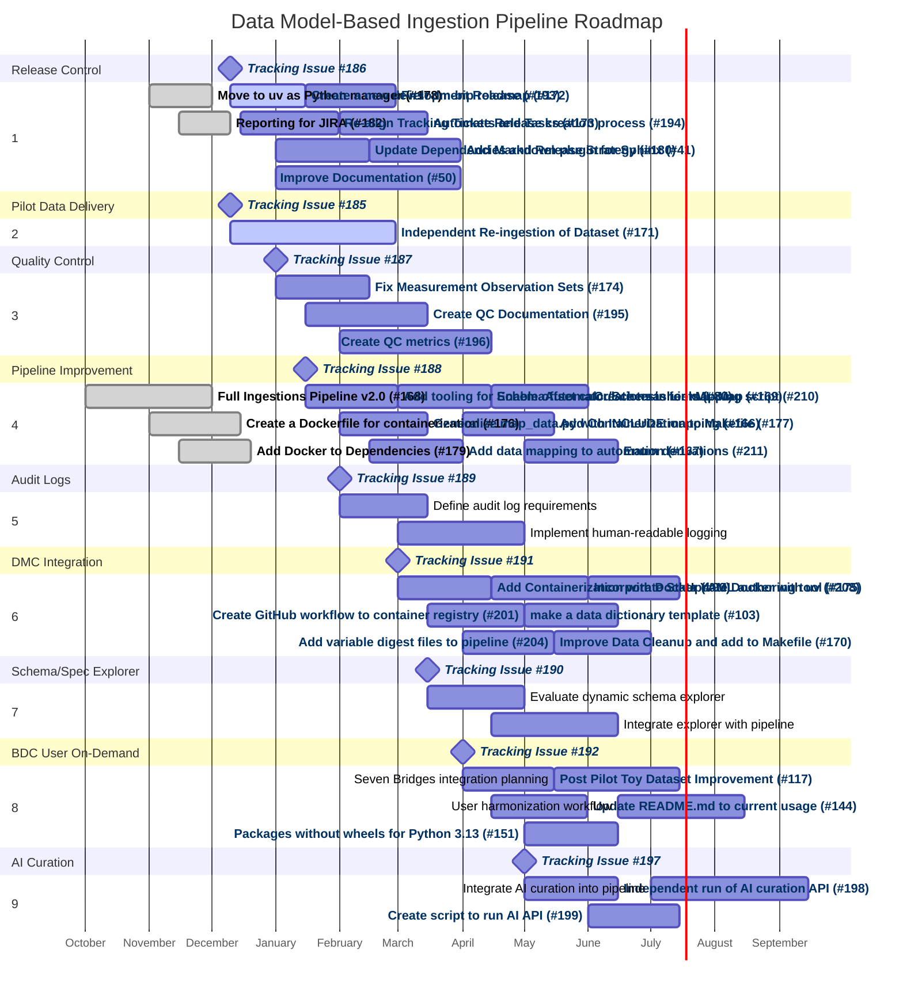

# Development Overview
This document contains the project development outline and assignments as well as associated timeline and project roadmap. This is intended to be used as a tool for organizing our project development and understanding our needs to meet out timeline.

# Project Roadmap
This Gantt chart represents a starting point for understanding the timeline for our development and serves a roadmap for our development stages. This a high-level chart showing the different parts of the project and how development time can ovelap. Currently, this is non-finalized and is intended only as a starting point for discussing the relative timelines of tasks.

# Project Outline
This outline captures the main features shown in the project roadmap above, organized by tracking issue. Each section corresponds to a GANTT chart section and its associated GitHub tracking issue. Sub-issues are listed under each tracking category.

## 1. Release Control (Tracking: #186)
Procedures for controlling releases of tool-chains, repositories, and data sets.
- [x] Move to uv as Python manager (#178) - Roman
- [x] Reporting for JIRA (#182) - Corey
- [ ] Create a new development Roadmap (#172) - Corey
- [ ] Re-align Tracking Tickets and Development Tasks (#173) - Corey
- [ ] Update Dependencies and Create Release Strategy (#180)
- [ ] First dm-bip release (#193) - Corey
- [ ] Automate Release creation process (#194) - Corey
- [ ] Improve Documentation (#50) - Corey
- [ ] Add Markdown plugin for Sphinx (#41) - Patrick

## 2. Pilot Data Delivery (Tracking: #185)
Preparation, ingestion, and QC of the original pilot data set.
- [ ] Independent Re-ingestion of Dataset (#171) - Roman, Corey

## 3. Quality Control (Tracking: #187)
Procedures and workflows for quality control.
- [ ] Fix Measurement Observation Sets (#174)
- [ ] Create QC Documentation (#195)
- [ ] Create QC metrics (#196)

## 4. Pipeline Improvement (Tracking: #188)
Improving automation, testing, workflows, and integration.
- [x] Full Ingestions Pipeline v2.0 (#168)
- [x] Create a Dockerfile for containerization (#176)
- [x] Add Docker to Dependencies (#179) - Vessie, Corey
- [ ] Add tooling for SchemaAutomator/Schemasheets (#80) - Trish
- [ ] Generalize map_data.py with INCLUDE mapping (#166) - Trish, Corey
- [ ] Add data mapping to automation (#167)
- [ ] Enable offset calculations in LinkML-Map (#169) - Madan
- [ ] Add Containerization to Makefile (#177)
- [ ] Create tests for mapping script (#210) - Corey
- [ ] Enum derivations (#211) - Roman, Corey

## 5. Audit Logs (Tracking: #189)
Logging, auditability, and human-readable data provenance.
- [ ] Define audit log requirements
- [ ] Implement human-readable logging

## 6. DMC Integration (Tracking: #191)
Integrating the Harmonization Pipeline into DMC pre-ingestion.
- [ ] Add Containerization with Docker (#90) - Patrick, Stephen
- [ ] Make a data dictionary template (#103) - Trish
- [ ] Improve Data Cleanup and add to Makefile (#170) - Roman, Corey
- [ ] Incorporate Stata YAML authoring tool (#175)
- [ ] Create GitHub workflow to container registry (#201) - Patrick
- [ ] Add variable digest files to pipeline (#204)
- [ ] Update Docker with uv (#208) - Vessie, Corey

## 7. Schema/Spec Explorer (Tracking: #190)
Dynamic Schema or Transformation Specification explorer tools.
- [ ] Evaluate dynamic schema explorer
- [ ] Integrate explorer with pipeline

## 8. BDC User On-Demand (Tracking: #192)
Bringing the Harmonization Pipeline to BDC for user on-demand harmonization.
- [ ] Post Pilot Toy Dataset Improvement (#117)
- [ ] Update README.md to current usage (#144) - Roman, Corey
- [ ] Packages without wheels for Python 3.13 (#151) - Patrick
- [ ] Seven Bridges integration planning
- [ ] User harmonization workflow

## 9. AI Curation (Tracking: #197)
AI curation pipeline for improving data curation and specification creation.
- [ ] Independent run of AI curation API (#198)
- [ ] Create script to run AI API (#199) - Corey
- [ ] Integrate AI curation into pipeline
