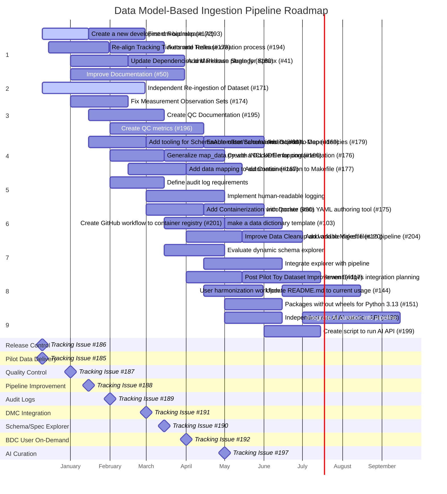

# Development Overview
This document contains the project development outline and assignments as well as associated timeline and project roadmap. This is intended to be used as a tool for organizing our project development and understanding our needs to meet our timeline.

# Project Roadmap
This Gantt chart represents the development roadmap for the next phase of dm-bip development. Each section corresponds to a GitHub Tracking Issue and its associated work items. The timeline spans approximately 9 months from December 2025 through September 2026.

# Project Outline
This outline captures the main features shown in the project roadmap above. Each section corresponds to a GitHub Tracking Issue with its associated sub-issues and work items. Status indicators: ✔️ completed, ▶️ in progress, ⏳ pending.

1. **Release Control - [Tracking Issue #186](https://github.com/linkml/dm-bip/issues/186)**
   > Procedures, workflows, and code supporting release control for tool-chains, repositories, and data sets.
   > JIRA: [BDMC-626](https://nhlbijira.nhlbi.nih.gov/browse/BDMC-626)
   1. ▶️ Create a new development Roadmap - [#172](https://github.com/linkml/dm-bip/issues/172)
   2. ⏳ Re-align Tracking Tickets and Development Tasks - [#173](https://github.com/linkml/dm-bip/issues/173)
   3. ⏳ Update Dependencies and Create Release Strategy - [#180](https://github.com/linkml/dm-bip/issues/180)
   4. ⏳ First dm-bip release - [#193](https://github.com/linkml/dm-bip/issues/193)
   5. ⏳ Automate Release creation process - [#194](https://github.com/linkml/dm-bip/issues/194)
   6. ⏳ Improve Documentation - [#50](https://github.com/linkml/dm-bip/issues/50)
   7. ⏳ Add plugin to process Markdown documentation with Sphinx - [#41](https://github.com/linkml/dm-bip/issues/41)

2. **Pilot Data Delivery - [Tracking Issue #185](https://github.com/linkml/dm-bip/issues/185)**
   > Preparation, ingestion, and QC of the original pilot data set along with delivery of that data as requested.
   > JIRA: [BDMC-621](https://nhlbijira.nhlbi.nih.gov/browse/BDMC-621)
   1. ▶️ Independent Re-ingestion of Dataset - [#171](https://github.com/linkml/dm-bip/issues/171)

3. **Quality Control - [Tracking Issue #187](https://github.com/linkml/dm-bip/issues/187)**
   > Procedures and workflows for quality controls, including correctives as needed.
   > JIRA: [BDMC-629](https://nhlbijira.nhlbi.nih.gov/browse/BDMC-629)
   1. ⏳ Fix Measurement Observation Sets - [#174](https://github.com/linkml/dm-bip/issues/174)
   2. ⏳ Create QC Documentation - [#195](https://github.com/linkml/dm-bip/issues/195)
   3. ⏳ Create QC metrics - [#196](https://github.com/linkml/dm-bip/issues/196)

4. **Pipeline Improvement - [Tracking Issue #188](https://github.com/linkml/dm-bip/issues/188)**
   > Improvements to automation, testing, workflows, and integration for the current pipeline.
   > JIRA: [BDMC-648](https://nhlbijira.nhlbi.nih.gov/browse/BDMC-648)
   1. ⏳ Add tooling to incorporate outputs from SchemaAutomator and Schemasheets - [#80](https://github.com/linkml/dm-bip/issues/80)
   2. ⏳ Generalize map_data.py with INCLUDE mapping - [#166](https://github.com/linkml/dm-bip/issues/166)
   3. ⏳ Add data mapping to automation - [#167](https://github.com/linkml/dm-bip/issues/167)
   4. ⏳ Enable offset calculations in LinkML-Map - [#169](https://github.com/linkml/dm-bip/issues/169)
   5. ⏳ Create a Dockerfile for containerization - [#176](https://github.com/linkml/dm-bip/issues/176)
   6. ⏳ Add Containerization to Makefile - [#177](https://github.com/linkml/dm-bip/issues/177)
   7. ⏳ Add Docker to Dependencies - [#179](https://github.com/linkml/dm-bip/issues/179)

5. **Audit Logs - [Tracking Issue #189](https://github.com/linkml/dm-bip/issues/189)**
   > Logging and auditability, including human-readable audit logs for data provenance. Also encompasses the variables repo at [NHLBI-BDC-DMC-HV](https://github.com/RTIInternational/NHLBI-BDC-DMC-HV).
   > JIRA: [BDMC-633](https://nhlbijira.nhlbi.nih.gov/browse/BDMC-633)
   1. ⏳ Define audit log requirements
   2. ⏳ Implement human-readable logging

6. **DMC Integration - [Tracking Issue #191](https://github.com/linkml/dm-bip/issues/191)**
   > Integration of the Harmonization Pipeline into DMC pre-ingestion work and the Data Submission Tracker and Self-Service Submission tool.
   > JIRA: [BDMC-635](https://nhlbijira.nhlbi.nih.gov/browse/BDMC-635)
   1. ⏳ Add Containerization with Docker - [#90](https://github.com/linkml/dm-bip/issues/90)
   2. ⏳ make a data dictionary template - [#103](https://github.com/linkml/dm-bip/issues/103)
   3. ⏳ Improve Data Cleanup and add to Makefile - [#170](https://github.com/linkml/dm-bip/issues/170)
   4. ⏳ Incorporate Stata YAML authoring tool - [#175](https://github.com/linkml/dm-bip/issues/175)
   5. ⏳ Create GitHub workflow to container registry - [#201](https://github.com/linkml/dm-bip/issues/201)
   6. ⏳ Add variable digest files to pipeline - [#204](https://github.com/linkml/dm-bip/issues/204)

7. **Schema/Spec Explorer - [Tracking Issue #190](https://github.com/linkml/dm-bip/issues/190)**
   > Dynamic Schema or Transformation Specification tools. External [repo](https://github.com/Sigfried/dynamic-model-var-docs) with [demo](https://sigfried.github.io/dynamic-model-var-docs/).
   > JIRA: [BDMC-634](https://nhlbijira.nhlbi.nih.gov/browse/BDMC-634)
   1. ⏳ Evaluate dynamic schema explorer
   2. ⏳ Integrate explorer with pipeline

8. **BDC User On-Demand Harmonization - [Tracking Issue #192](https://github.com/linkml/dm-bip/issues/192)**
   > Bringing the Harmonization Pipeline to BDC for user on-demand harmonization, allowing users to run harmonization themselves.
   > JIRA: [BDMC-636](https://nhlbijira.nhlbi.nih.gov/browse/BDMC-636)
   1. ⏳ Post Pilot Toy Dataset Improvement - [#117](https://github.com/linkml/dm-bip/issues/117)
   2. ⏳ Update README.md to current usage - [#144](https://github.com/linkml/dm-bip/issues/144)
   3. ⏳ Packages without wheels for Python 3.13 - [#151](https://github.com/linkml/dm-bip/issues/151)
   4. ⏳ Seven Bridges integration planning
   5. ⏳ User harmonization workflow

9. **AI Curation - [Tracking Issue #197](https://github.com/linkml/dm-bip/issues/197)**
   > AI curation pipeline for improving data curation and specification creation.
   > JIRA: [BDMC-649](https://nhlbijira.nhlbi.nih.gov/browse/BDMC-649) / [BDMC-638](https://nhlbijira.nhlbi.nih.gov/browse/BDMC-638)
   1. ⏳ Independent run of AI curation API - [#198](https://github.com/linkml/dm-bip/issues/198)
   2. ⏳ Create script to run AI API - [#199](https://github.com/linkml/dm-bip/issues/199)
   3. ⏳ Integrate AI curation into pipeline
