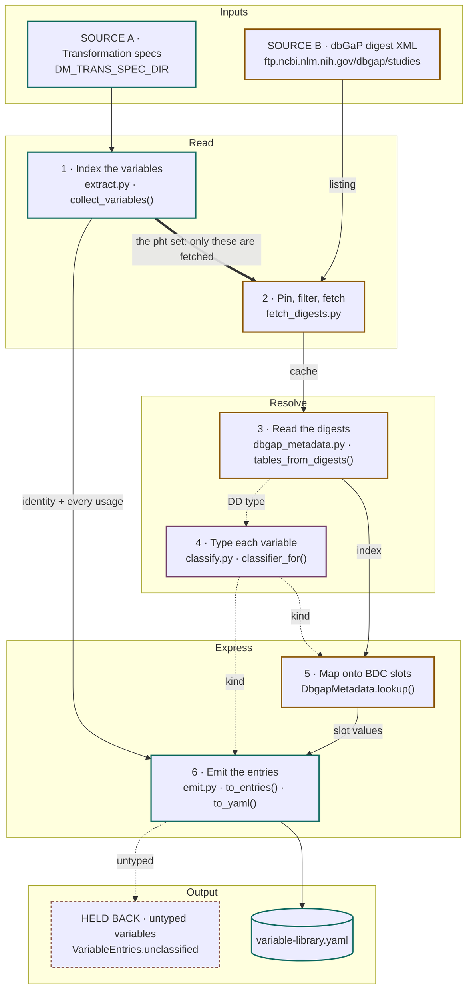

# Variable Library Extractor

Design notes for `src/dm_bip/variable_lib/`: a deterministic command that reads
transformation specs, fetches the dbGaP data dictionaries those specs reference, and emits
BDC variable library entries (`SingleContinuousVariable` and `SingleCategoricalVariable`
instances). Deliverable 4.5 Task 2,
[tis-lab/BDC-Add-On-Tracker#93](https://github.com/tis-lab/BDC-Add-On-Tracker/issues/93).
Modeled on the mapping-provenance tool, whose spec-reading layer it reuses.

## Why the study/dataset/variable join matters

dbGaP identifies phenotype data at three nested levels, each with its own accession prefix:
a **study** (`phs`) holds **datasets** (`pht`), which hold **variables** (`phv`).

```
phs000101              study      the study as registered in dbGaP
└── pht000113          dataset    one table within it
    └── phv10111300    variable   one column in that table
```

Only all three together identify a measurement: `phv10111300` on its own does not say which
table it came from, and equivalent variables recur across studies under different
accessions. [linkml/dm-bip#352](https://github.com/linkml/dm-bip/issues/352) is the
governing requirement: **the join must survive harmonization.** The BDC variable library's
own representation flattens contributing sources into parallel comma-delimited lists, which
breaks it.

A transformation spec states the join directly: the dataset is a class-level
`populated_from`, the variables are the slot-level ones beneath it, and the study is the
directory they sit in. That is why each entry carries the full phv/pht/phs triple, and it is
what makes the dbGaP half possible: a `(pht, phv)` pair indexes straight into a data
dictionary.

---

## The chain

Two provenance streams converge on one file. The transformation specs say *which* source
variables exist and what they feed; the dbGaP digests say what those variables *mean*, and
which of the two classes each takes.



The two crossing edges are the ones worth reading. Stage 1's set of `pht` accessions
becomes the filter on stage 2's download, so a cohort's full published listing is never
fetched. And the classifier built in stage 4 is consulted twice: once to pick the entry
class, once to decide which slot set stage 5 is even allowed to return.

All of it happens in one process. Stage 2 is the only one that writes to disk, yielding the
digest cache, which later runs reuse.

---

## What the typing signal looks like

**The join to the data dictionary is exact, not fuzzy.** The canonical DD that
schema-automator's adapter renders from a dbGaP digest pair is one table per `pht`, and
each row's `uri` carries the `phv`:

```
name     type                 description               codes                unit   min  max  uri
BMI01    decimal              Body mass index, exam 1.                       kg/m2  13.1 61.2 dbgap:phv00204719.v1
SEX      permissible_values   Reported sex.             2, Female | 1, Male                   dbgap:phv00000002.v1
```

So `(pht, phv)` from a trans spec indexes directly into the dictionary, keyed on the bare
accession. Specs are unversioned (`phv00202843`); the DD carries dbGaP's versioned form
(`phv00202843.v2`), and the join strips the version.

**The `type` column is the decision.** The adapter resolves it from dbGaP's declared
`<type>` and the var_report's `calculated_type` into a closed vocabulary: `integer` and
`decimal` are quantities; `permissible_values`, `boolean`, `string` and the temporal and
identifier types are labels. `schema-create` reads the same DD, so the two consumers agree
by construction. Nothing here applies a distinct-value threshold or any other heuristic to
decide what counts as categorical; that would be a second rule, made here, about a question
the adapter has already answered.

---

## Design decisions

### Layers: parse, decide, express

```
src/dm_bip/variable_lib/
├── extract.py          # spec → VariableRecord (the IR)
├── classify.py         # DD type → continuous | categorical
├── dbgap_metadata.py   # digests → canonical DD index → BDC slot values
├── emit.py             # VariableRecord + kind + metadata → schema instances
└── datamodel/          # gen-pydantic output
```

plus `prepare_study/fetch_digests.py`, which fetches and caches the digests. Same split as
`mapping_prov`: extraction depends only on the specs and stays testable on its own, and
`dbgap_metadata.py` is the only layer that knows BDC slot names.

### Reuse the spec-reading layer, don't re-parse

`extract.py` imports `iter_spec_blocks`, `spec_url`, `read_study` and `default_base_dir`
from `dm_bip.mapping_prov.extract`; nothing in `variable_lib` parses YAML itself. That
layer is owned by `mapping_prov`, and improving it improves both consumers. If a third
consumer appears, those should be lifted into a shared module rather than imported
sideways.

### The IR accumulates, it doesn't overwrite

This is the one place the design deliberately differs from `mapping_prov`, which
deduplicates variable entities by id and so records only a variable's *first* use. A
variable library entry *is* the variable, so it must state everything that variable feeds:

- `VariableUsage`: frozen, ordered: `target_class`, `slot`, `via_expression`, `spec_id`
- `VariableRecord`: `accession`, `datasets`, `study_id`, `usages`

`via_expression` is kept because an identifier woven into a `uuid5()` call is a materially
weaker claim about a variable's role than a value copied straight across.

### The generation shim

`src/dm_bip/variable_lib/schema/variable_lib_schema.yaml` exists only because `gen-pydantic`
takes a local file and will not accept a URL. It adds nothing of its own, importing the
upstream `bdc-variable-library` schema by URL and tracking `main` deliberately so upstream
fixes are picked up when the datamodel is regenerated.

### `datasets` is a set

Nothing in the spec format prevents the same accession appearing under two `pht` values.
`file_id` is single-valued, so `sole_dataset()` collapses it, warning and picking the lowest
accession rather than silently taking whichever spec was read first.

The choice is load-bearing: the chosen `pht` decides which data dictionary is consulted, and
with it the variable's type and every descriptive slot. ARIC has one such variable today,
`phv00516587`, which two `spirometry.yaml` blocks file under a table whose dictionary does
not declare it ([NHLBI-BDC-DMC-HV#880][hv-880]); it collapses to that table and is held
back. Preferring the `pht` under which a dictionary actually knows the variable would be
the better rule.

### Classification reads the data dictionary's type, and nothing else

The canonical DD already carries a `type` for every variable, resolved by schema-automator's
adapter from dbGaP's declared and calculated types, and `schema-create` reads the same DD.
So the continuous-or-categorical decision is made once, upstream, and `classify.py` only
maps that vocabulary onto the two classes. A variable the dictionary does not describe is
`unknown`, counted, and held back, rather than typed from a second source that might
disagree with the first. `classifier_for(tables)` returns `always_unknown` and says so when
there are no dictionaries at all.

One limit is inherited from upstream. The adapter currently types any variable that carries
codes as `permissible_values`, so a numeric variable with sentinel codes (an age with `-9`
for missing) comes out categorical. [linkml/schema-automator#231][sa-231] asks the adapter
to check `calculated_type` first, and that fix reaches the library with no change here.

### Unclassified variables are held back, not defaulted

`source_id` and `file_id` are defined only on the two typed classes, so there is no
correctly-typed home for an unclassified variable's identity, and defaulting to either
class would assert something unproven about the data. They are collected in
`VariableEntries.unclassified`, counted, and reported.

### Output is grouped, not a flat list

`to_yaml` emits `single_continuous_variables:` and `single_categorical_variables:`, both
keys always present, unset slots omitted rather than written as nulls. Continuous entries
carry `minimum_value` and `maximum_value`; categorical ones carry `coded_values`.

### The metadata source is given the classifier

`to_entries` picks the entry class by calling the classifier, then calls `lookup`, which is
not told what it picked. The two classes are not interchangeable, and returning the union of
their slots would leave `emit`'s `model_fields` filter to drop the mismatches, warning once
per dropped key per variable. `DbgapMetadata` is handed the **same** classifier instead, so
it returns exactly the accepted slot set and the two can never disagree.

### Determinism

- Records sorted by accession; usages sorted within each record and deduplicated.
- Digest files loaded in sorted order.
- Coded values kept in **document order**: dbGaP orders them meaningfully (Yes/No, severity
  scales), and the order of an input file is already stable.
- No `uuid4()` and no timestamps anywhere; ids derive from the accession.

Running twice and diffing gives byte-identical output, and a cold-fetch run and a cached run
produce the same file.

---

## What fills each slot

**From the specs**, available without any second input:

| Slot | Value | From |
|---|---|---|
| `id` | `dbgap:phv10111300` | accession, matching the mapping-prov convention |
| `source_id` | `phv10111300` | `VariableRecord.accession` |
| `file_id` | `pht000113` | `VariableRecord.sole_dataset()` |
| `associated_study` | `bdchm:Study/phs000280` | `read_study()`, a **placeholder today**, pending study identity |
| `variable_description` | rendered from `usages` | `describe()` |

**From the canonical DD**, everything else:

| Slot | DD column | Notes |
|---|---|---|
| `variable_name` | `name` | dbGaP's VARNAME |
| `source_variable_description` | `description` | dbGaP's VARDESC |
| `file_name` | the DD's filename | dbGaP's table name, which the pipeline puts in the filename |
| `data_type` | `type` | mapped onto the BDC enum |
| `minimum_value`, `maximum_value` | `min`, `max` | **Continuous only.** The var_report's observed bounds |
| `coded_values` | `codes` | **Categorical only**, in document order |
| `unit` | `unit` | **Continuous only.** Empty until the adapter carries `<unit>` ([#231][sa-231]) |
| `comment` | `comment` | Empty until the adapter carries `<comment>` ([#231][sa-231]) |
| `missing_value` | `missing_values` | **Continuous only.** Sentinel codes; empty until the adapter writes the column ([#231][sa-231]) |
| `resolution`, `alert_values` | none | Always empty; dbGaP states neither, and deriving them would be inference |

`associated_study` is **never** supplied by the metadata source. `emit` merges `lookup`'s
return over the identity fields, so returning it would let a table contributed by another
study overwrite the study the spec belongs to.

A real entry, the first five slots from the spec and the rest from the dictionary:

```yaml
single_continuous_variables:
- id: dbgap:phv00203151
  associated_study: bdchm:Study/phs000280
  variable_description: Source for Quantity.value_decimal
  source_id: phv00203151
  file_id: pht004032
  file_name: ANTA
  variable_name: ANTA01
  source_variable_description: '[Height and weight]. Standing height (to the nearest
    cm). Q1 [Anthropometry Form, ANTA. Visit 1]'
  data_type: integer
  minimum_value: '125'
  maximum_value: '199'
```

Keys with no matching slot on the chosen class are dropped with a warning rather than
silently discarded.

`associated_study`'s range is `ResearchStudy`, but that class is not inlined and defines
only `id`, so `gen-pydantic` emits the slot as a plain string holding a reference. Study
identity has nowhere to live except that id string.

---

## Fetching dbGaP metadata

### The fetch is selective

A cohort's `pheno_variable_summaries/` directory holds every dataset the study ever
published; ARIC's has 736 files. The `pht` accession is in each filename:

```
phs000280.v8.pht004027.v3.ABI04.data_dict.xml
                └──────┘
```

so the listing is filtered to the datasets the specs name before anything is downloaded, at
no extra request cost. The ARIC specs name 163 datasets, so that is **326 files instead of
736**. At the half-second courtesy delay between NCBI requests, a cold ARIC run takes about
three minutes; cached runs re-read from disk. A dataset the specs name but the listing lacks
is reported by accession.

### Why both digest files are fetched

They are not interchangeable. `data_dict.xml` is what the study **declares**:

```xml
<variable id="phv00203151.v2">
  <name>ANTA01</name>
  <description>[Height and weight]. Standing height (to the nearest cm). Q1</description>
  <type>string</type>
  <unit>cm</unit>
</variable>
```

`var_report.xml` is what the data **contains**:

```xml
<variable id="phv00203151.v2.p2" calculated_type="integer" reported_type="string">
  <total><stats><stat n="15045" nulls="2" mean="168.5" min="125" max="199"/></stats></total>
</variable>
```

Note the disagreement: ARIC declares a standing height in centimetres as
`<type>string</type>`. Across the 1286 ARIC spec variables that have a dictionary:

| | `data_dict` | `var_report` |
|---|---|---|
| bounds | `<logical_min>` present on **0** | `<stat min max>` present on **100%** of numeric variables |
| type signal | `<type>` is one of four spellings, all reading as string or encoded | `calculated_type` is a closed vocabulary: `integer`, `decimal`, `enum_integer`, `string` |

That is why `--no-var-report` is not the default. It halves the download and produces
entries with no bounds and a `data_type` derived from the declared type, which for
ARIC-shaped studies means `string` on real measurements.

---

## Running it

The library needs the specs and a cohort, and nothing else: no prepared data, no inferred
schema, no validation output or mapped data.

```sh
# One directory of specs (one study), typed and described from that cohort's dictionaries
dm-bip extract-variable-library path/to/specs/<study> \
  --cohort aric \
  -o variable-library.yaml

# As part of the pipeline, with every path resolved from the pipeline config
make variable-library   CONFIG=path/to/study.mk DM_COHORT=aric
```

`--cohort` may be omitted: the command reads the study accession from the specs'
`researchstudy.yaml` and matches it against the upstream cohort manifests, reporting which
cohort it picked. Pass it explicitly when the spec directory has no `researchstudy.yaml`,
which release repos often don't carry. Omitting it on a study with no dbGaP presence is not
an error: the command says so, reports every variable as untyped, and emits nothing, since
there is no dictionary to type from.

Directories are searched recursively for `*.yaml` spec files, as in
[mapping provenance](mapping-provenance.md).

| Option | Default | Effect |
|---|---|---|
| `--cohort` | auto-detect | dbGaP cohort key (`aric`, `jhs`, …); `dm-bip fetch-digests --list` shows them |
| `--dbgap-cache` | `.dbgap-cache` | Where fetched XML lives. Gitignored |
| `--no-fetch` | fetches | Use only what is already cached, a genuine offline path |
| `--no-var-report` | uses both | Skip `var_report.xml`. Halves the download and **loses observed bounds** |
| `--refresh` | reuses cache | Re-download files already cached |
| `--dd-dir` | none | Read canonical DD TSVs (`*.dd.tsv`) from this directory, typically what `adapt-digests` wrote, instead of fetching and adapting digests. The fetch options above are then not consulted |

Without `--dd-dir`, the fetched digests are adapted in memory with the same schema-automator
adapter that `adapt-digests` runs, so both paths read the same canonical DD; only the
serialization to a file is skipped.

Where each argument comes from, for any study:

| Argument | Pipeline variable |
|---|---|
| spec dir | `DM_TRANS_SPEC_DIR` |
| `-o` | `VARIABLE_LIBRARY_FILE`, i.e. `$(DM_OUTPUT_DIR)/variable-library.yaml` |
| `--cohort` | `DM_COHORT` |
| `--dbgap-cache` | `DM_DBGAP_CACHE_DIR` |

`variable-library` is **not** wired into `make pipeline` and is **not** produced as a side
effect of `make map-data`; it has to be asked for by name. Being a file target, it prints
"Nothing to be done" when the output is newer than the specs. Delete just that file to force
a rebuild. The dbGaP cache is deliberately *not* a prerequisite: it is network-populated and
managed by the command, so listing it would leave the target perpetually out of date. The
direct `dm-bip extract-variable-library` form always regenerates.

### Exercising it without a real study

Only the spec-reading half runs without a real cohort, because the dictionary is what types
a variable. The [study-palette](https://github.com/tis-lab/study-palette) synthetic corpus
is the fixture for that path: its accessions are fictional, no cohort manifest pins that
study, and NCBI has nothing to fetch. It needs no data staged:

```sh
SYNTH=/path/to/study-palette/synthetic
uv run dm-bip extract-variable-library $SYNTH/specs/example_study_one -o /dev/null
```

```
No study accession in these specs; without a data dictionary nothing can be typed
0 entries from 54 source variables (0 continuous, 0 categorical)
54 variables could not be typed and were skipped (no dbGaP data dictionaries loaded)
```

That check runs *before* the cohort registry is consulted, so a study that cannot match one
never triggers the network fetch that loading it would require.

To regenerate the checked-in datamodel after an upstream schema change (needs network):

```bash
make variable-lib-datamodel
```

## Running the tests

```bash
uv run pytest tests/unit/variable_lib tests/unit/test_fetch_digests.py -q
```

These are offline. The classifier fixtures are DD TSVs under `tests/input/variable_lib/dd/`,
and the digest fixtures under `tests/input/variable_lib/dbgap/` are small hand-written XML
covering a table contributed by another study and a table declared under one `pht` in two
files. The full `make test` also runs `tests/integration/test_mapping_prov_schema.py`, which
needs network.

The pydantic `UserWarning` about `FieldInfo(annotation=NoneType...)` is pre-existing noise
from the generated datamodel, not a failure.

---

## The other consumer: `adapt-digests`

The same digest cache feeds a second target, `make adapt-digests`, which wraps `schemauto
adapt-dbgap` once per data_dict/var_report pair to write the canonical DD as a TSV under
`output/$(DM_COHORT)/dd/`. The variable library reads those TSVs with `--dd-dir`; without
it, it calls the same adapter in memory.

The adapter's TSV serializer rejects a value dbGaP publishes with no `code` attribute
(`<value>N/A</value>`), so `adapt-digests` halts on the first such table; 17 of ARIC's 368
data dictionaries have one, and `make -k` writes the rest. It is an upstream defect, tracked
with the adapter's other gaps as [linkml/schema-automator#231][sa-231]. The library's
default path keeps the adapter's output in memory and never serializes, so those tables
enrich normally there. A library built from a `make -k adapt-digests` directory lacks them.

---

## Known limitations

- **Units are empty.** The adapter does not yet carry dbGaP's `<unit>` ([#231][sa-231],
  item 2). When it does, the library normalizes to UCUM and passes unmapped units through in
  the study's own spelling.
- **Decimal slots serialize as quoted strings**, `minimum_value: '125'`. That is `Decimal`
  round-tripping through `model_dump(mode="json")`, and it is stable. Not a bug.
- **Duplicate codes are preserved.** Fifteen ARIC variables list the same code twice.
  Echoing a dbGaP defect faithfully beats silently disagreeing with dbGaP.

## Remaining work

- **Sentinel-coded numerics** come out categorical until the adapter checks
  `calculated_type` before codes ([linkml/schema-automator#231][sa-231], item 5).
- **Real study accession**: needs the study-identity question answered.
- **`sole_dataset()` should prefer a known dictionary** rather than the lowest accession,
  now that the choice decides which metadata a variable gets.
- **Integration test** validating emitted entries against the upstream schema. Needs a
  decision on whether to validate against the generation shim or the upstream URL.
- **Upstream schema defect**: the `alert_value`/`alert_values` duplication in
  bdc-variable-library is unfiled.

[sa-231]: https://github.com/linkml/schema-automator/issues/231
[hv-880]: https://github.com/RTIInternational/NHLBI-BDC-DMC-HV/issues/880
